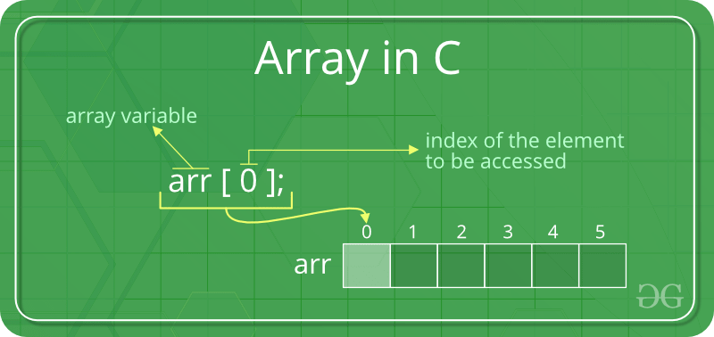
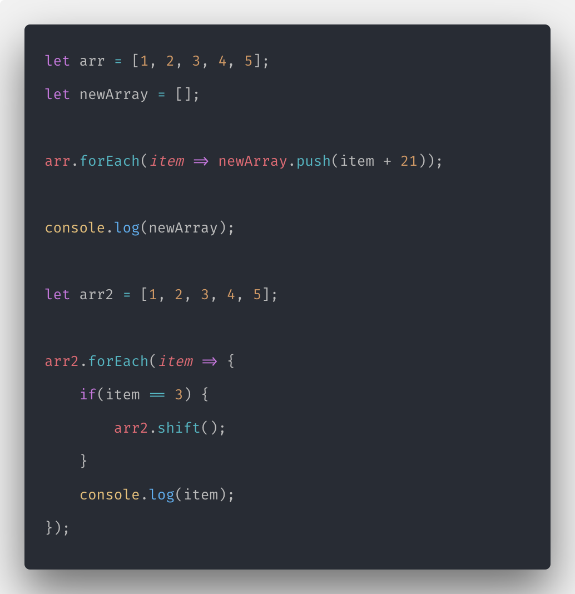
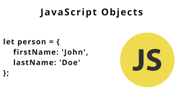
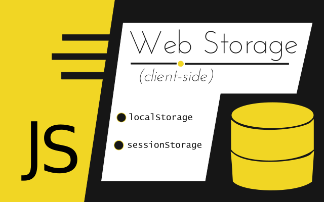
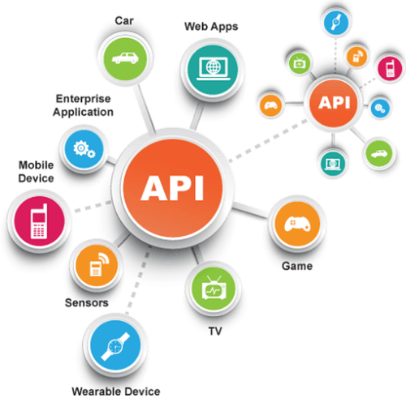
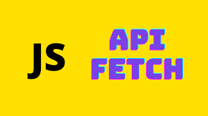

# JAVASCRIPT ARRAY & MULTI ARRAY
<p align="center">

</p>

* __Array__ adalah tipe data list order yang dapat menyimpan tipe data apapun di dalamnya. __Array__ dapat menyimpan tipe data String, Number, Boolean, dan lainnya. Sederhannya array adalah pengelompokan data yang di simpan dalam list [].

```
// ikanPantai
// 1. Tongkol
// 2. Tuna
// 3. Nila

let ikanPantai = ['Tongkol', 'Tuna', 'Nila'];
console.log(ikanPantai);

// Menyimpan Banyak Data
// String, number, dan Boolean

let randomData = ['ini string', 20 , true];
console.log(randomData);
```
## UPDATE ARRAY

* Seperti tipe data dan variabel pada umumnya, kita dapat mengupdate data pada Array.

```
// ikanPantai
// 1. Tongkol
// 2. Tuna
// 3. Nila

let ikanPantai = ['Tongkol', 'Tuna', 'Nila'];

ikanPantai[0] = 'Kakap';
console.log(ikanPantai);
// output:['Kakap', 'Tuna', 'Nila'];
```
## CONST IN ARRAY

* Jika menggunakan let, kita dapat mengubah array  dengan array baru dan konten nilai yang ada di dalam array dengan nilai lain, Const tidak bisa melakukan update data. Namun pada Array kita dapat melakukan update konten nilai di dalam array (mutable). Yang tidak bisa adalah mengubah array dengan array yang baru jika menggunakan const.
```
const ikanPantai = ['Tongkol', 'Tuna', 'Nila'];

ikanPantai = ['Hiu'];
console.log(ikanPantai);
// output: Error, Tidak dapat update array baru


const ikanPantai = ['Tongkol', 'Tuna', 'Nila'];

ikanPantai[2] = ['Hiu'];
console.log(ikanPantai);
// output: ['Tongkol', 'Tuna', Hiu];
```
## ARRAY PROPERTIES

* __Array__ memiliki 5 properti yang sering digunakan yaitu constructor, length, index, input, dan prototype. Properties adalah fitur yang sudah disediakan oleh Javascript untuk memudahkan developer.
```
- Length, length akan mengembalikan nilai dari jumlah panjang data suatu array.

let ikanPantai = ['Tongkol', 'Tuna', 'Nila'];
console.log(ikanPantai.length);
// output: 3
```
* [Pelajari Lebih Lanjut.](https://www.w3schools.com/jsref/jsref_obj_array.asp)

## ARRAY METHODS

* Array memiliki method atau biasa disebut built-in methods.
Artinya Javascript sudah memudahkan kita dengan menyediakan function/method umum yang bisa kita gunakan.Kita tidak perlu membuat function lagi jika method yang kita butuhkan sudah tersedia.Sama halnya dengan Array properti. Kita bisa cek dokumentasi untuk melihat method yang sudah tersedia pada link ini [built-in methods](https://www.w3schools.com/jsref/jsref_obj_array.asphttps://www.w3schools.com/jsref/jsref_obj_array.asp) atau [MDN documentation](https://developer.mozilla.org/en-US/docs/Web/JavaScript/Reference/Global_Objects/Array)

```
.push() adalah method untuk menambahkan item  array pada urutan yang paling akhir.

.pop() adalah method yang menghapus item array index terakhir.

.shift() adalah method untuk menghapus item Array pada index pertama

.unshift() adalah method untuk menambahkan item Array pada index pertama

.sort() adalah method untuk mengurutkan secara Ascending atau Descending Alphanumeric

```

## LOOPING IN ARRAY

* Array memiliki built in methods untuk melakukan looping yaitu .map() dan .forEach()
```
.forEach() adalah method untuk melakukan looping pada setiap elemen array.

.map() melakukan perulangan/looping dengan membuat array baru.

```
<p align='center'>
</p>

> Kita bisa lihat bahwa .map() dan forEach() sama-sama melakukan looping dan mengembalikan nilai baru dari operasi yang dilakukan, Perbedaannya adalah .forEach tidak dapat membuat Array baru dari hasil operasi yang ada dalam looping, Jadi, gunakan .forEach() jika hanya memerlukan looping untuk menampilkan saja atau menyimpan ke database. Gunakan .map() jika akan melakukan operasi pada array seperti yang dapat mengubah nilai array sebelumnya.

## ARRAY MULTIDIMENSIONAL

* jadi array multidimenional adalah array of array atau array di dalam array. 

```
let inventory = [
    ['kaos polos', 10],
    ['jacket', 5],
    ['topi', 3],
];

console.log(inventory);
```
## Akses index multidimensional array
```
let inventory = [
    ['kaos polos', 10],
    ['jacket', 5],
    ['topi', 3],
];

console.log(inventory[1][0]);
// output: jacket
```
## Method built-in array
```
let inventory = [
    ['kaos polos', 10],
    ['jacket', 5],
    ['topi', 3],
];

inventory.push(['sweater', 4]);

console.log(inventory);
// output:[
    ['kaos polos', 10],
    ['jacket', 5],
    ['topi', 3],
    ['sweater', 4],
];
```
# GIT & GITHUB LANJUTAN

<p align="center">
</p>

* GIT LOG Dari dua revisi yang sudah dilakukan kita dapat melihat catatal log dari revisi - revisi tersebut dengan menggunakan perintah berikut ini:
* git log untuk melihat catatan log revisi yang telah kita lakukan di dalam repositori git kita.
```
git log
```
> Tips, Untuk git log yang lebih pendek, bisa menggunakan perintah berikut ini:
```
git log --oneline
```
##  Melihat log dari berbagai sisi.

1. Melihat log dari nomor verion

```
git log 2c704c338577dbf68ab098f8d6b5cc6234c1bd8f
```

2. Melihat log dari file tertentu
```
git log index.html
```
3. Melihat log berdasarkan Author
```
log log --author='dinda'
```
## GIT CHECKOUT, GIT RESET, GIT REVERT

1. Cek perubahan
```
git diff
```
2. Membatalkan perubahan-belum stagged & dan Belum commit
```
git chekout index,html
```
3. Membatalkan perubahan-sudah stagged & dan Belum commit
```
git reset HEAD <file>
```
4. Membatalkan Perubahan - Sudah Stagged namun Belum Commited
```
git reset index.html
```
## GIT REVERT
1. GIT Revert akan membatalkan semua perubahan yang ada tanpa menghapus commit terakhir. Jika menggunakan GIT Reset, commit terakhir akan hilang.
```
git revert -n <nomorcommit>
```
## GIT BRANCH

> Untuk collab
```
git branch <branch>
```
*  delete branch
```
git branch -d<branch>
```
## GIT MERGE

* untuk menyatukan branch cabang fitur yg telah di kembangkan.
```
git merge halaman_login
```
# JAVASCRIPT OBJECT

<p align="center">
</p>

* __Javascript__ programming, object adalah sebuah tipe data pada variabel yang menyimpan properti dan fungsi (method)
Properti adalah data lengkap dari sebuah object. Method adalah action dari sebuah object. Apa saja yang dapat dilakukan dari suatu object.

```
let orang ={
    name: 'Jhon',
    age: 18,
    isVerified: true,
}

console,log(orang.name); // 'Jhon'
```
> Kita juga bisa Mengunakan Bracket notion.
```
let orang ={
    name: 'Jhon',
    age: 18,
    isVerified: true,
}

console,log(orang[name]); // 'Jhon'
```
## kita bisa mengganti atau update object.
```
let orang ={
    name: 'Jhon',
    age: 18,
    isVerified: true,
}

orang.age = 24;

console,log(orang);
// output:
{
    name: 'Jhon',
    age: 18,
    isVerified: true,
}
```
> Kita tidak bisa mengganti Variabel constant

## Update seluruh data
```
let orang ={
    name: 'Jhon',
    age: 18,
    isVerified: true,
}

orang = {
    fullname: 'Jhone Doe',
}

console,log(orang);
// output:
{
    fullname: 'Jhone Doe',
}
```
## Delete object property
```
let orang ={
    name: 'Jhon',
    age: 18,
    isVerified: true,
}

delete orang.age; 

console,log(orang);
// output:
{
    name: 'Jhon',
    isVerified: true,
}
```
# JAVASCRIPT RECURSIVE

* Recursive adalah function yang memanggil dirinya sendiri sampai kondisi tertentu. Recursive kebanyakan digunakan untuk case matematika, fisika, kimia, dan yang berhubungan dengan calculation.
### CONTOH
```
function recursive(){
    if(conditional) {
        // stop calling itself
        // ...
    } else {
        recursive();
    }
}
```
# JAVASCRIPT REGEX

* Regex adalah susunan karakter/deretan karakter spesial yang menggambarkan pattern/pola untuk pencarian text pada sebuah string atau document.
 Regex = Text matching.

## Literals

* Literals adalah konsep regex yang paling sederhana dimana kita membuat regex sesuai dengan text yang ingin kita cari/match atau mengandung text yang kita cari.

## Test()
* avascript regex punya beberapa built-in methods untuk Regex. Sala satunya adalah test(). test() mengembalikan nilai BOOLEAN (TRUE/FALSE) untuk kecocokan sebuat text yang dicari.
```
let regex1 = new RegExp('monkeys');
console.log(regex1.test('monkeys')) //output: true
```
## Match()
* match() sama seperti test() yaitu sebuah method bawaan dari javascript. Namun match() mengembalikan nilai array dari karakter yang match.
```
let myRegex = /d/;
let myName = ' David Winalda';
console.log(myName.match(myRegex));
```
## Flags
* Ada 6 flags dalam Javascript. Kita bahas 2 dahulu yang sering digunakan:i = Untuk menghandle case-sensitive. Tidak mempermasalahkan besar kecilnya sebuah karakter. Tidak membedakan antara A dan a.
g = Untuk mencari kedalam seluruh string yang ingin dicari. Jika tidak menggunakan flags g, maka sistem akan mengembalikan nilai array pertama yang ditemukan saja atau tidak melanjutkan pencarian.
```
let myRegex = /d/i;
let myName = ' David Winalda';
console.log(myName.match(myRegex));
```
# JAVASCRIPT-OOP
* Object Oriented Programming (OOP) adalah suatu paradigma dalam pemrograman. OOP adalah principle. Jadi dapat diterapkan pada bahasa programming selain Javascript seperti Ruby, Python, dan Java.
## 4 Pilar pada OOP
1. Encapsulation adalah cara untuk membatasi akses langsung ke properti atau method dari sebuah objek.
2. Inheritance dalam OOP adalah sebuah proses dimana sebuah class mewariskan property dan methodnya ke class lain atau childnya.
3. Polymorpish ini juga dikenal pada konsep OOP yang berarti kemampuan dari suatu objek untuk memiliki banyak bentuk, method yang diwariskan bisa kita ubah dengan behaviour yang berbeda menyesuaikan child class yang kita buat.
4. Abstraction adalah sebuah teknik untuk menyembunyikan detail tertentu dari sebuah objek/method dan hanya menampilkan fungsionalitas atau fitur penting dari objek tersebut.
# JAVASCRIPT MODULES
* __Moduels__ adalah reusable code yang dapat di export dari suatu file javascript dan di import ke file javascript yang lain. reusable code adalah data yang dapat di gunakan berulang kali.
# JAVASCRIPT WEB STORAGE
<p align="center">
</p>

* Objek localStorage dan sessionStorage, bagian dari API penyimpanan web, adalah dua alat hebat untuk menyimpan pasangan kunci/nilai secara lokal. Menggunakan localStorage dan sessionStorage untuk penyimpanan adalah alternatif untuk menggunakan cookie dan ada beberapa keuntungan.
* localStorage dan sessionStorage hampir identik dan memiliki API yang sama. Perbedaannya adalah bahwa dengan sessionStorage, data hanya bertahan sampai jendela atau tab ditutup. Dengan localStorage, data dipertahankan hingga pengguna secara manual menghapus cache browser atau hingga aplikasi web Anda menghapus data. Tutorial ini menampilkan localStorage, tetapi sintaks untuk sessionStorage sama.

1. Creating, Reading, and Updating Entries
```
let key = 'Item 1';
localStorage.setItem(key, 'Value');

let myItem = localStorage.getItem(key);

localStorage.setItem(key, 'New Value');
```
2. Deleting and Clearing Entries
```
localStorage.removeItem(key);

localStorage.clear();
```
3. Storing Non-String values with JSON
```
let myObj = { name: 'Skip', breed: 'Labrador' };
localStorage.setItem(key, JSON.stringify(myObj));

let item = JSON.parse(localStorage.getItem(key));
```
4. Checking for Items
```
if (localStorage.length > 0) {
  // ...
}


if (localStorage.length > 0) {
  // ...
} else {
  // ...
}
```
5. Iterating Over Items
```
for (let i = 0; i < localStorage.length; i++){

}


for (let i = 0; i < localStorage.length; i++){
  let key = localStorage.key(i);
}

for (let i = 0; i < localStorage.length; i++){
  let key = localStorage.key(i);
  let value = localStorage.getItem(key);
}

for (let i = 0; i < localStorage.length; i++){
  let key = localStorage.key(i);
  let value = localStorage.getItem(key);
  console.log(key, value);
}
```
# JAVASCRIPT ASYCHRONOUS

* "I will finish later!" Fungsi yang berjalan secara paralel dengan fungsi lain disebut asinkron Contoh yang bagus adalah JavaScript setTimeout()
```
function myDisplayer(something) {
  document.getElementById("demo").innerHTML = something;
}

function myCalculator(num1, num2, myCallback) {
  let sum = num1 + num2;
  myCallback(sum);
}

myCalculator(5, 5, myDisplayer);
```
## Javascript Asynchronous
* “Bayangkan kamu masih kecil. Ibumu berjanji padamu bahwa dia akan membelikanmu telepon baru minggu depan.”

* Anda tidak tahu apakah Anda akan mendapatkan telepon itu sampai minggu depan. Ibumu benar-benar dapat membelikanmu telepon baru, atau dia tidak.

* Itu adalah sebuah janji. Sebuah janji memiliki tiga keadaan. Mereka:

* Tertunda: Anda tidak tahu apakah Anda akan mendapatkan telepon itu
Terpenuhi: Ibu senang, dia membelikanmu ponsel baru
Ditolak: Ibu tidak senang, dia tidak membelikanmu telepon
```
// ES5: Part 1

var isMomHappy = false;

// Promise
var willIGetNewPhone = new Promise(
    function (resolve, reject) {
        if (isMomHappy) {
            var phone = {
                brand: 'Samsung',
                color: 'black'
            };
            resolve(phone); // fulfilled
        } else {
            var reason = new Error('mom is not happy');
            reject(reason); // reject
        }

    }
);
```
## API and HTTP Request
<p align="center">
</p>
* Application Programming Interfaces (API) adalah konstruksi yang tersedia dalam bahasa pemrograman untuk memungkinkan pengembang membuat fungsionalitas yang kompleks dengan lebih mudah. Mereka mengabstraksikan kode yang lebih kompleks dari Anda, menyediakan beberapa sintaks yang lebih mudah untuk digunakan sebagai gantinya.

## JSON
<p align="center">
</p>

* JSON — kependekan dari JavaScript Object Notation — adalah format untuk berbagi data. Seperti namanya, JSON berasal dari bahasa pemrograman JavaScript, tetapi tersedia untuk digunakan oleh banyak bahasa termasuk Python, Ruby, PHP, dan Java. JSON biasanya diucapkan seperti nama “Jason.” JSON menggunakan ekstensi .json saat berdiri sendiri. Ketika didefinisikan dalam format file lain (seperti dalam .html), itu bisa muncul di dalam tanda kutip sebagai string JSON, atau bisa menjadi objek yang ditetapkan ke variabel. Format ini mudah ditransmisikan antara server web dan klien atau browser.
## JAVASCRIPT FETCH

<p align="center">
</p>

* Fetch API menyediakan antarmuka JavaScript untuk mengakses dan memanipulasi bagian dari pipeline HTTP, seperti permintaan dan respons. Ini juga menyediakan metode fetch() global yang menyediakan cara mudah dan logis untuk mengambil sumber daya secara asinkron di seluruh
